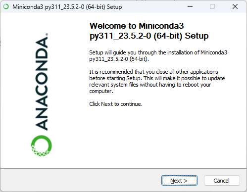
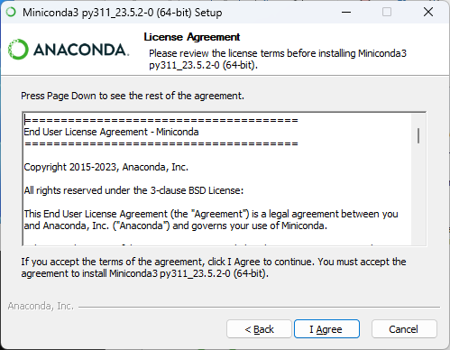
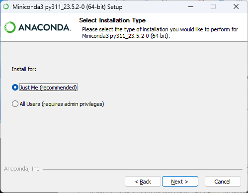
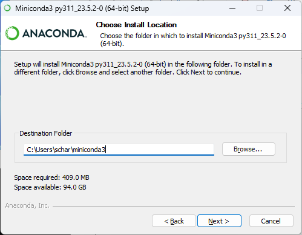
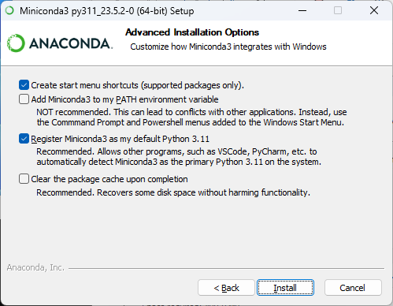
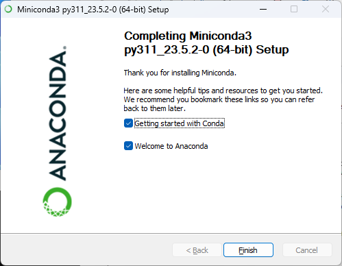

## Setup miniconda to use phreeqcrm in a jupyter notebook (~5 GB)

Install miniconda (https://docs.conda.io/en/latest/miniconda.html)













### Open 'Anaconda Powershell Prompt (miniconda3)' from the 'Miniconda3 (64-bit)' menu item

#### Create phreeqcrm environment:
```
conda create --name phreeqcrm python --yes
```

#### Activate phreeqcrm environment
```
conda activate phreeqcrm
```

#### Install matplotlib (optional but recommended)
```
conda install matplotlib --yes
```

#### Install phreeqcrm
```
conda install -c conda-forge phreeqcrm --yes
```

#### Install Jupyter Notebook
```
conda install -c conda-forge notebook --yes
```

#### Change to ex11-advect directory
```
cd .\swig\python\ex11-advect\
```

#### Start jupyter notebooks
```
jupyter notebook
```

#### In the web browser double-click the `ex11-advect.ipynb` file

#### To test the install use the menu item:
```
Kernel -> Restart Kernel and Run All Cells... -> Restart
```

#### To close and shutdown notebook
```
File -> Close and Shut Down Notebook -> Ok
```

### Shutdown jupyter
```
File -> Shut Down -> Shut Down
```

## To remove phreeqcrm environment
```
conda remove --name phreeqcrm --all
```

## Uninstall miniconda
(see https://stackoverflow.com/questions/29596350/how-to-uninstall-mini-conda-python)

### Open 'Anaconda Powershell Prompt (miniconda3)' from the 'Miniconda3 (64-bit)' menu item

#### Activate phreeqcrm environment
```
conda activate phreeqcrm
```

#### Install anaconda-clean
```
conda install anaconda-clean
```

#### Run anaconda-clean
```
anaconda-clean --yes
```

#### Uninstall Miniconda
```
Open Control Panel -> Programs -> Uninstall a program and select 'miniconda'
```
